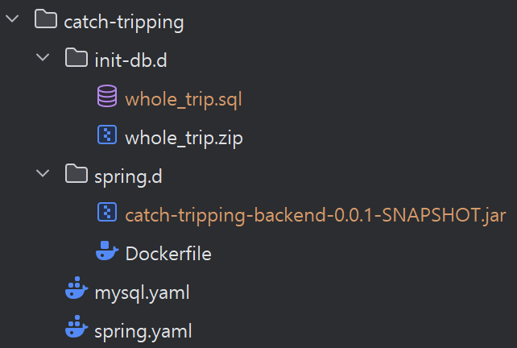

# Docker


### MYSQL 홀로 띄우기

1. `catch-tripping/init-db.d/whole_trip.zip` 압축을 풀어 `init-db.d` 폴더 바로 밑에 `whole_trip.sql` 이 존재하게 해주세요. 

#### 시작
```sh
docker compose -f catch-tripping\mysql.yaml -p catch-tripping up -d mysql
```
- `-f mysql.yaml` : 특정한 yaml 파일을 사용하도록 지정
- `-p catch-tripping` : Docker Compose 에서 프로젝트 이름 지정
- `-d mysql` : mysql 서비스가 백그라운드에서 실행. docker ps 등을 통해 실행 상태를 확인 가능. 스페이스를 구분으로 추가될 서비스 지정 가능.

#### 종료
```sh
docker compose -f catch-tripping\mysql.yaml -p catch-tripping stop
```

#### 삭제
```sh
docker compose -f catch-tripping\mysql.yaml -p catch-tripping down
```
Docker Compose가 생성한 모든 컨테이너, 네트워크, 볼륨 등을 삭제
-  `--volumes` : 볼륨 삭제도 원한다면
- `--rmi all` : 이미지 삭제도 원한다면


### Spring + MYSQL 같이 띄우기

1. `catch-tripping/init-db.d/whole_trip.zip` 압축을 풀어 `init-db.d` 폴더 바로 밑에 `whole_trip.sql` 이 존재하게 해주세요.
2. `gradle bootJar` 을 실행

#### 시작
```sh
docker compose -f catch-tripping\spring.yaml -p catch-tripping up -d mysql spring
```
#### 종료
```sh
docker compose -f catch-tripping\spring.yaml -p catch-tripping stop
```
#### 삭제
```sh
docker compose -f catch-tripping\spring.yaml -p catch-tripping down
```

```sh
docker rmi catch-tripping-spring
```